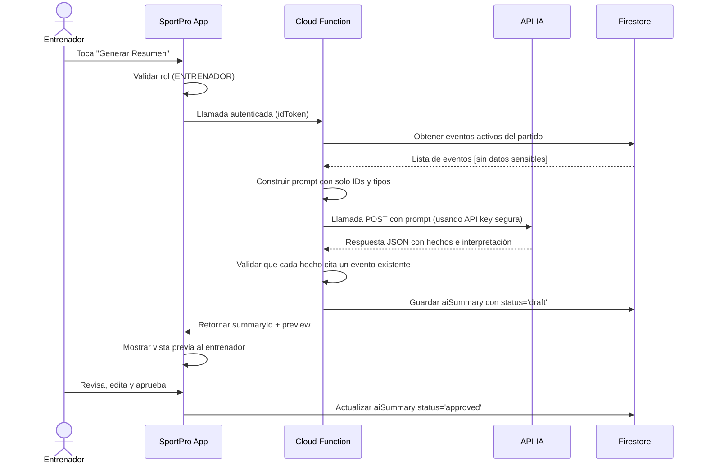

# Diseño Técnico: Registro de Eventos en Tiempo Real e Integración con IA

**Autores:** Henry Aaron Tovar Landa (24100514), Julia Jhamilett Rojas Estrada (24100478)

**Fecha:** 2 de Octubre de 2026

**Asignatura:** Desarrollo de Aplicaciones Móviles - ESAN University

---

## 1. Introducción

Este documento describe la arquitectura técnica para el registro dinámico de eventos de un partido en tiempo real en la aplicación SportPro, así como la integración segura con un proveedor de IA para generar resúmenes narrativos del partido.

### 1.1 Objetivos

- Permitir que un operador autorizado registre eventos de un partido en vivo desde un dispositivo móvil
- Sincronizar eventos en tiempo real a todos los dispositivos conectados
- Manejar casos de datos incompletos, errores de red y correcciones de eventos
- Integrar IA de forma segura sin exponer datos sensibles de menores
- Permitir que un entrenador revise y apruebe el resumen narrativo antes de publicarlo

### 1.2 Conceptos Clave

- **Evento:** Acción registrada durante el partido (gol, tarjeta, cambio, etc.)
- **Catálogo de Eventos:** Conjunto configurable de tipos de eventos y sus campos requeridos
- **Operador Autorizado:** Usuario con rol ENTRENADOR o ADMIN que puede registrar eventos
- **Trazabilidad:** Registro de quién creó, modificó o anuló cada evento

---

## 2. Modelo de Datos de Firestore

### 2.1 Estructura de Partidos y Eventos

```
matches/{matchId}
├── name: string
├── teamA: string (ID del equipo)
├── teamB: string (ID del equipo)
├── date: timestamp
├── status: 'not_started' | 'in_progress' | 'finished'
├── operatorId: string (UID del usuario que registra eventos)
├── createdAt: timestamp (server-side)
├── updatedAt: timestamp (server-side)
├── isActive: boolean
│
└── events/{eventId}
    ├── type: string (ej. 'gol', 'tarjeta', 'cambio')
    ├── minute: integer
    ├── team: string (teamA o teamB)
    ├── playerId: string | null (null si jugador desconocido)
    ├── playerName: string (nombre del jugador involucrado)
    ├── notes: string (observaciones opcionales)
    ├── createdBy: string (UID del operador)
    ├── createdAt: timestamp (server-side)
    ├── version: integer (para correcciones)
    ├── status: 'active' | 'corrected' | 'voided'
    ├── correctionOf: string | null (ID del evento original si es corrección)
    └── metadata
        ├── latitude: float | null
        ├── longitude: float | null
        └── deviceInfo: string

└── eventCatalog/{catalogId}
    ├── id: string (ej. 'gol', 'tarjeta_amarilla')
    ├── displayName: string (ej. "Gol")
    ├── icon: string
    ├── requiredFields: array['minute', 'team', 'playerId']
    ├── optionalFields: array['notes']
    ├── isActive: boolean
    └── updatedAt: timestamp

└── aiSummaries/{summaryId}
    ├── draftText: string
    ├── facts: array
    │   ├── [0]
    │   │   ├── text: string
    │   │   ├── eventIds: array [IDs de eventos fuente]
    │   │   └── type: 'gol' | 'tarjeta' | etc.
    │   └── ...
    ├── interpretation: string
    ├── status: 'draft' | 'approved' | 'rejected'
    ├── approvedBy: string | null (UID del entrenador)
    ├── approvalNotes: string
    ├── generatedAt: timestamp
    └── approvedAt: timestamp | null
```

### 2.2 Ventajas del Diseño

- **Append-only events:** Los eventos nunca se borran, solo se marcan como anulados (audit trail)
- **Version control:** Cada corrección registra el ID del evento original
- **Server-side timestamps:** Firestore asigna `createdAt` y `updatedAt` para evitar desincronización
- **Catálogo dinámico:** Los tipos de eventos se sincronizan en tiempo real via listeners
- **Separación de hechos e interpretación:** Permite validar que la IA no invente datos

---

## 3. Sincronización en Tiempo Real

### 3.1 Snapshot Listeners

La aplicación utiliza Firestore Snapshot Listeners para recibir actualizaciones en tiempo real:

```kotlin
// Escuchar cambios en eventos del partido
firestore.collection("matches")
    .document(matchId)
    .collection("events")
    .orderBy("createdAt")
    .addSnapshotListener { snapshot, error ->
        if (error != null) {
            handleError(error)
            return@addSnapshotListener
        }
        snapshot?.documentChanges?.forEach { change ->
            when (change.type) {
                ADDED -> updateScoreboard(change.document.toObject<MatchEvent>())
                MODIFIED -> correctEventUI(change.document.toObject<MatchEvent>())
                REMOVED -> removeEventUI(change.document.id)
            }
        }
    }
```

### 3.2 Gestión de Desconexión Temporal

Si el operador pierde conexión:

1. **Offline persistence habilitado:** Firestore local guarda eventos en caché
2. **Sincronización automática:** Cuando se restaura la conexión, Firestore reintenta enviar
3. **Resolución de conflictos:** Si hay cambios simultáneos, se aplica la siguiente lógica:
   - Los eventos con timestamp más reciente prevalecen
   - Las correcciones de eventos posteriores anulan cambios previos
   - Se registra un audit log de conflictos

### 3.3 Tabla de Casos de Prueba para Datos Incompletos

| Caso | Entrada | Comportamiento Esperado | Estado |
|------|---------|------------------------|--------|
| Evento sin minuto | minute = null | Se acepta con advertencia; se muestra "Minuto desconocido" | ✓ |
| Evento sin jugador | playerId = null | Se aceptan eventos de equipo (ej. penal) | ✓ |
| Evento registrado tarde | minute = 88 después que evento de minuto 92 | Se permite; la lista se ordena por minuto | ✓ |
| Desconexión breve (3 seg) | Envío fallido, reconexión automática | Se reintenta; no se pierden datos | ✓ |
| Corrección de evento | Marcar evento 5 como anulado, crear evento 5b | Evento 5 status = voided, 5b status = active | ✓ |
| Catálogo actualizado | Se agrega nuevo tipo "var" durante partido | Todos los operadores reciben actualización vía listener | ✓ |

---

## 4. Arquitectura de Registro en Tiempo Real

### 4.1 Flujo del Operador

```
┌─────────────────────────────────────────────┐
│  Operador toca "Registrar evento" en la UI  │
└──────────────────┬──────────────────────────┘
                   │
                   ▼
┌─────────────────────────────────────────────┐
│  MatchEventScreenVM valida entrada:         │
│  - Minuto dentro del rango (0-90+)          │
│  - Equipo válido (teamA o teamB)            │
│  - Si requiere jugador: verifica playerId   │
└──────────────────┬──────────────────────────┘
                   │
         ┌─────────▼─────────┐
         │ Validación OK?    │
         └────┬─────────┬────┘
         Sí   │         │   No
             ▼         ▼
        [Enviar]   [Mostrar error]
             │
             ▼
┌─────────────────────────────────────────────┐
│ MatchRepository.addEvent()                  │
│ → firestore.collection("matches")           │
│   .document(matchId)                        │
│   .collection("events")                     │
│   .add(event) // Firestore asigna ID       │
└──────────────────┬──────────────────────────┘
                   │
         ┌─────────▼──────────┐
         │ Conexión de red OK? │
         └────┬─────────┬──────┘
         Sí   │         │   No
             ▼         ▼
        [Sincronizar]  [En caché local,
             │          reintentará]
             │
             ▼
┌─────────────────────────────────────────────┐
│ Snapshot Listener dispara en todos los      │
│ dispositivos conectados:                    │
│ - Actualiza marcador                        │
│ - Actualiza cronología                      │
│ - Notifica a entrenadores                   │
└─────────────────────────────────────────────┘
```

### 4.2 Corrección de Eventos

Si el operador comete un error:

```
Evento original (ID: event-001):
{
  type: 'gol',
  minute: 45,
  playerId: 'player-10',
  team: 'teamA',
  status: 'active'
}

▼ Operador nota error: era el minuto 46, no 45

Nuevo evento (ID: event-002):
{
  type: 'correction',
  correctionOf: 'event-001',
  minute: 46,
  playerId: 'player-10',
  team: 'teamA',
  status: 'active',
  notes: 'Corrección: minuto era 46, no 45'
}

▼ Sistema aplica lógica:

Evento original ahora:
{
  ...,
  status: 'corrected',
  correctionBy: 'event-002'  // referencia cruzada
}

UI muestra: Gol de player-10 en minuto 46 (evento-001 oculto, usando datos de event-002)
```

---

## 5. Integración con Proveedor de IA

### 5.1 Arquitectura de Seguridad

**Principio clave:** La aplicación móvil **NUNCA** contiene ni utiliza la clave API del proveedor de IA.

```
┌──────────────────┐                ┌──────────────────────┐
│   SportPro App   │                │   Firebase Cloud     │
│   (móvil)        │                │   Function           │
│                  │────────────────│  (lado servidor)     │
│  • Recopila      │ Llamada        │                      │
│    eventos del   │ autenticada    │  • Valida rol        │
│    partido       │ con idToken    │    (ENTRENADOR)      │
│                  │                │                      │
│  • Envía IDs de  │ Devuelve       │  • Construye prompt  │
│    eventos       │ análisis JSON  │    solo desde eventos│
│                  │                │                      │
│  • Valida que    │ (Contiene refs │  • Llama a API       │
│    cada hecho    │  a evento IDs) │    (usando env var)  │
│    cita un       │                │                      │
│    evento        │                │  • Valida que cada   │
│                  │                │    hecho sea verifi- │
│                  │                │    cable en la BD    │
│                  │                │                      │
│                  │                │  • Rechaza hechos    │
│                  │                │    sin evento fuente │
└──────────────────┘                └──────────────────────┘
       ▲                                      │
       │ NUNCA expone API key                │
       │ NUNCA contiene credenciales         │
       │                                     │
       └─────────────────────────────────────┘
```

### 5.2 Cloud Function: Generar Resumen (TypeScript)

```typescript
import * as functions from 'firebase-functions';
import * as admin from 'firebase-admin';

const CLAUDE_API_KEY = process.env.CLAUDE_API_KEY || '';
const CLAUDE_API_URL = 'https://api.anthropic.com/v1/messages';

admin.initializeApp();
const db = admin.firestore();

interface MatchEvent {
  id: string;
  type: string;
  minute: number;
  team: string;
  playerName?: string;
  notes?: string;
  status: 'active' | 'corrected' | 'voided';
}

interface AIPromptRequest {
  matchId: string;
}

interface AIPromptResponse {
  facts: Array<{
    text: string;
    eventIds: string[];
    confidence: number;
  }>;
  interpretation: string;
  estimatedTokens: number;
}

/**
 * Función callable para generar resumen narrativo del partido.
 * Solo accesible para usuarios con rol ENTRENADOR.
 */
export const generateMatchSummary = functions.https.onCall(
  async (data: AIPromptRequest, context) => {
    // 1. Validación de autenticación
    if (!context.auth) {
      throw new functions.https.HttpsError(
        'unauthenticated',
        'Usuario no autenticado'
      );
    }

    const uid = context.auth.uid;

    // 2. Validación de rol (solo entrenador)
    const userDoc = await db.collection('users').doc(uid).get();
    const userData = userDoc.data();

    if (userData?.role !== 'ENTRENADOR' && userData?.role !== 'ADMIN') {
      throw new functions.https.HttpsError(
        'permission-denied',
        'Solo entrenadores pueden generar resúmenes'
      );
    }

    const { matchId } = data;

    // 3. Recuperar eventos activos del partido
    const eventsSnapshot = await db
      .collection('matches')
      .doc(matchId)
      .collection('events')
      .where('status', '==', 'active')
      .orderBy('minute', 'asc')
      .get();

    const events: MatchEvent[] = [];
    eventsSnapshot.forEach((doc) => {
      const event = doc.data();
      if (event.status !== 'voided') {
        events.push({ id: doc.id, ...event } as MatchEvent);
      }
    });

    // 4. Construir prompt para IA (solo datos públicos)
    const eventSummary = events
      .map(
        (e) =>
          `[Evento ${e.id}] Minuto ${e.minute}: ${e.type} - ${e.team} - ${e.playerName || 'Desconocido'}`
      )
      .join('\n');

    const systemPrompt = `Eres un comentarista deportivo profesional. 
Tu tarea es generar un resumen narrativo de un partido de fútbol basado ÚNICAMENTE en los eventos registrados.

INSTRUCCIONES CRÍTICAS:
1. NUNCA inventes jugadas, eventos o detalles que no estén en la lista de eventos.
2. Cada afirmación de hecho DEBE citar el ID del evento que lo respalda (ej. "[por Evento 001]").
3. Separa claramente hechos verificables (con referencias a evento IDs) de interpretaciones deportivas.
4. Si un evento parece inconsistente o dudoso, menciónalo explícitamente.
5. Responde en español, en tono profesional pero ameno.
6. Máximo 300 palabras.

ESTRUCTURA REQUERIDA:
{
  "facts": [
    {
      "text": "Descripción del hecho",
      "eventIds": ["id-evento-1", "id-evento-2"],
      "type": "gol|tarjeta|cambio|..."
    }
  ],
  "interpretation": "Análisis e interpretación del desarrollo del partido"
}`;

    const userPrompt = `Genera el resumen narrativo de este partido basándote ÚNICAMENTE en estos eventos:

${eventSummary}

Recuerda: SOLO puedes usar información de los eventos listados. No inventes detalles.`;

    // 5. Llamar a API de Claude (o tu proveedor IA)
    let aiResponse: string;
    try {
      const response = await fetch(CLAUDE_API_URL, {
        method: 'POST',
        headers: {
          'x-api-key': CLAUDE_API_KEY,
          'anthropic-version': '2023-06-01',
          'content-type': 'application/json',
        },
        body: JSON.stringify({
          model: 'claude-opus-4-1-20250805',
          max_tokens: 1024,
          system: systemPrompt,
          messages: [{ role: 'user', content: userPrompt }],
        }),
      });

      if (!response.ok) {
        const error = await response.json();
        throw new Error(`API error: ${error.message}`);
      }

      const data = await response.json();
      aiResponse = data.content[0].text;
    } catch (error) {
      console.error('Error al llamar API de IA:', error);
      throw new functions.https.HttpsError(
        'internal',
        'Error al generar resumen con IA'
      );
    }

    // 6. Parsear respuesta de IA
    let parsedResponse: AIPromptResponse;
    try {
      parsedResponse = JSON.parse(aiResponse);
    } catch (e) {
      throw new functions.https.HttpsError(
        'internal',
        'Respuesta de IA no es JSON válido'
      );
    }

    // 7. VALIDACIÓN CRÍTICA: Verificar que cada hecho cita eventos existentes
    for (const fact of parsedResponse.facts) {
      for (const eventId of fact.eventIds) {
        const eventExists = events.some((e) => e.id === eventId);
        if (!eventExists) {
          throw new functions.https.HttpsError(
            'invalid-argument',
            `La IA citó un evento inexistente: ${eventId}. Reintentando...`
          );
        }
      }
    }

    // 8. Guardar borrador en Firestore para revisión del entrenador
    const summaryId = db
      .collection('matches')
      .doc(matchId)
      .collection('aiSummaries')
      .doc().id;

    await db
      .collection('matches')
      .doc(matchId)
      .collection('aiSummaries')
      .doc(summaryId)
      .set({
        draftText: aiResponse,
        facts: parsedResponse.facts,
        interpretation: parsedResponse.interpretation,
        status: 'draft',
        approvedBy: null,
        generatedAt: admin.firestore.FieldValue.serverTimestamp(),
        generatedByUid: uid,
        matchId: matchId,
      });

    // 9. Retornar respuesta (sin exponer detalles internos)
    return {
      success: true,
      summaryId: summaryId,
      preview: aiResponse.substring(0, 200) + '...',
      factsCount: parsedResponse.facts.length,
      message: 'Resumen generado. Revisa y aprueba antes de publicar.',
    };
  }
);
```

### 5.3 Validación de Hechos en la App Móvil

```kotlin
/**
 * Valida que cada hecho del resumen cite eventos existentes.
 */
fun validateAISummary(summary: AISummary, events: List<MatchEvent>): ValidationResult {
    val eventIds = events.map { it.id }.toSet()
    
    val invalidFacts = summary.facts.filter { fact ->
        fact.eventIds.any { eventId ->
            !eventIds.contains(eventId)
        }
    }
    
    return if (invalidFacts.isEmpty()) {
        ValidationResult.Valid
    } else {
        ValidationResult.Invalid(
            message = "Algunos hechos citan eventos inexistentes: " +
                      invalidFacts.map { it.eventIds }.flatten().joinToString(", ")
        )
    }
}
```

---

## 6. Privacidad de Menores

### 6.1 Datos Sensibles No Enviados a IA

-Datos físicos (altura, peso)
-Información de contacto (teléfono, email)
-Contacto de emergencia
-Datos de pago / mensualidades
-Ubicación geográfica del hogar

### 6.2 Datos Permitidos

- Nombre del jugador (o dorsal si se prefiere)
- Número de dorsal
- Posición en el equipo
- Eventos deportivos (goles, tarjetas, cambios)

### 6.3 Cumplimiento Normativo

Las reglas de Firestore (firestore.rules) garantizan:

- Padres pueden ver solo a sus hijos
- Otros padres no ven datos de otros jugadores menores
- Jugadores menores no ven datos físicos de otros jugadores
- Información sensible solo accesible a ADMIN/ENTRENADOR

---

## 7. Diagrama de Secuencia: Generar Resumen



---

## 8. Pruebas y Validación

### 8.1 Casos de Prueba de Red

| Caso | Simulación | Validación |
|------|-----------|-----------|
| Pérdida de conexión 5 seg | Desactivar WiFi/Datos | Evento se guarda en caché, se sincroniza al reconectar |
| Múltiples eventos simultáneos | 5 operadores tocan "registrar" a la vez | Todos llegan con timestamp único; no hay conflictos |
| Catálogo cambia durante partido | ADMIN agrega "VAR" mientras se juega | Todos los operadores reciben actualización vía listener |

### 8.2 Casos de Prueba de IA

| Caso | Entrada | Validación |
|------|---------|-----------|
| IA inventa un gol | Eventos: [cambio min 10, tarjeta min 20] → IA dice "gol min 15" | Validación rechaza; no hay evento gol |
| IA omite un evento | Eventos: [gol min 20, tarjeta min 25] → IA solo menciona gol | Se permite; es interpretación |
| Hecho bien citado | Eventos: [gol min 20 event-001] → IA dice "Gol [por event-001]" | Se acepta y aprueba |

---

## 9. Implementación de Componentes

### 9.1 MatchEventScreenVM

```kotlin
class MatchEventScreenVM(
    private val matchRepository: MatchRepository,
    private val playerRepository: PlayerRepository,
    matchId: String
) : ViewModel() {
    
    private val _uiState = MutableStateFlow<MatchEventUiState>(
        MatchEventUiState.Loading
    )
    val uiState: StateFlow<MatchEventUiState> = _uiState.asStateFlow()
    
    init {
        loadMatchEvents(matchId)
    }
    
    private fun loadMatchEvents(matchId: String) {
        viewModelScope.launch {
            matchRepository.getMatchEvents(matchId).collect { result ->
                when (result) {
                    is Result.Loading -> _uiState.value = MatchEventUiState.Loading
                    is Result.Success -> {
                        val scoreA = result.data.count { it.team == "teamA" && it.type == "gol" }
                        val scoreB = result.data.count { it.team == "teamB" && it.type == "gol" }
                        _uiState.value = MatchEventUiState.Success(
                            events = result.data,
                            scoreA = scoreA,
                            scoreB = scoreB
                        )
                    }
                    is Result.Error -> _uiState.value = MatchEventUiState.Error(result.message)
                }
            }
        }
    }
    
    fun addEvent(event: MatchEvent) {
        // Validar y enviar evento
    }
}
```

### 9.2 Catálogo de Eventos

```kotlin
object MatchEventCatalog {
    val events = listOf(
        MatchEventType(
            id = "gol",
            displayName = "Gol",
            icon = "⚽",
            requiredFields = listOf("minute", "team", "playerId"),
            optionalFields = listOf("notes")
        ),
        MatchEventType(
            id = "tarjeta_amarilla",
            displayName = "Tarjeta Amarilla",
            icon = "🟨",
            requiredFields = listOf("minute", "team", "playerId"),
            optionalFields = listOf("notes")
        ),
        // ... más eventos
    )
}
```

---

## 10. Roadmap Futuro

- [ ] Estadísticas en vivo (posesión, saques, faltas)
- [ ] Alineaciones dinámicas visual
- [ ] Análisis de rendimiento post-partido
- [ ] Integración con wearables (frecuencia cardíaca)
- [ ] Multiidioma para resúmenes de IA
- [ ] Exportación de actas oficiales

---

## 11. Referencias

- Firebase Firestore Documentation: https://firebase.google.com/docs/firestore
- Offline Data Persistence: https://firebase.google.com/docs/firestore/manage-data/enable-offline
- Cloud Functions for Firebase: https://firebase.google.com/docs/functions
- Security Rules: https://firebase.google.com/docs/firestore/security/overview

---

**Fin del Documento**
