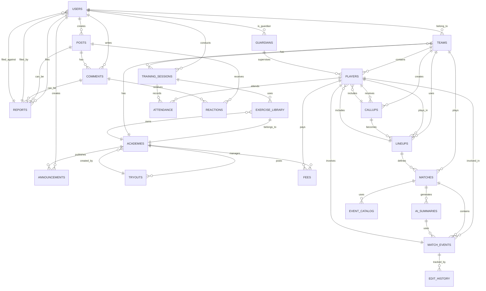

# Modelo de Datos - SportPro

## Estructura Firestore

### Colecciones Principales

#### 1. `users/{uid}`
Almacena información de todos los usuarios del sistema.

**Campos:**
- `uid` (string, PK): ID de Firebase Authentication
- `email` (string): Correo electrónico único
- `displayName` (string): Nombre completo
- `role` (string): DT, Jugador, Padre, Admin
- `photoUrl` (string, nullable): URL de foto en Storage
- `dateOfBirth` (timestamp): Fecha de nacimiento
- `gender` (string, nullable): Masculino/Femenino/Otro
- `createdAt` (timestamp): Fecha de creación de cuenta
- `updatedAt` (timestamp): Fecha última actualización
- `isActive` (boolean): Usuario activo o inactivo
- `teamIds` (array<string>): IDs de equipos a los que pertenece (referencia)
- `academyIds` (array<string>): IDs de academias asociadas

**Seguridad:**
- `read`: Usuario mismo, admin, DT/coach del equipo
- `write`: Usuario mismo, admin

**Índices:**
- `email` (ascendente)
- `role` (ascendente)
- `createdAt` (descendente)

---

#### 2. `academies/{academyId}`
Almacena info de academias/clubes.

**Campos:**
- `academyId` (string, PK): ID único
- `name` (string): Nombre de academia
- `description` (string, nullable): Descripción
- `location` (string): Ubicación
- `phone` (string, nullable): Teléfono
- `email` (string): Email de contacto
- `adminIds` (array<string>): UIDs de administradores
- `createdAt` (timestamp): Fecha creación
- `createdBy` (string): UID creador (admin)
- `logo Url` (string, nullable): URL del logo

**Subcollecciones:**
- `teams/{teamId}`: Equipos de la academia

---

#### 3. `academies/{academyId}/teams/{teamId}`
Equipos dentro de una academia.

**Campos:**
- `teamId` (string, PK): ID único
- `academyId` (string): Academia padre (FK)
- `name` (string): Nombre del equipo
- `category` (string): Sub-10, Sub-15, Primera, Otra
- `description` (string, nullable): Descripción
- `year` (number): Año/ciclo del equipo
- `dtIds` (array<string>): UIDs de entrenadores del equipo
- `createdAt` (timestamp): Fecha creación
- `createdBy` (string): UID creador

**Índices:**
- `category` (ascendente)
- `academyId` (ascendente)

---

#### 4. `academies/{academyId}/teams/{teamId}/players/{playerId}`
Jugadores registrados en un equipo.

**Campos:**
- `playerId` (string, PK): UID del usuario
- `teamId` (string): Equipo padre (FK)
- `joinDate` (timestamp): Fecha de ingreso al equipo
- `status` (string): activo, inactivo, transferido
- `position` (string, nullable): Defensa, Mediocampista, Delantero, Portero
- `number` (number, nullable): Dorsal
- `height` (number, nullable): Altura en cm
- `weight` (number, nullable): Peso en kg
- `emergencyContact` (object):
  - `name` (string): Nombre contacto emergencia
  - `phone` (string): Teléfono
  - `relationship` (string): Relación (padre, madre, otro)
  - `updatedAt` (timestamp)
- `stats` (object, denormalized):
  - `gamesPlayed` (number): Partidos jugados
  - `goalsScored` (number): Goles anotados
  - `yellowCards` (number): Tarjetas amarillas
  - `redCards` (number): Tarjetas rojas
  - `lastUpdated` (timestamp)

**Seguridad:**
- `read`: DT del equipo, jugador mismo (propio), padre del jugador, admin
- `write`: DT del equipo, admin, jugador (algunos campos)

---

#### 5. `guardians/{guardianId}`
Padres/apoderados y sus vínculos con jugadores.

**Campos:**
- `guardianId` (string, PK): UID del usuario padre
- `email` (string): Email del padre
- `displayName` (string): Nombre del padre
- `players` (array<object>): Lista de hijos vinculados
  - `playerId` (string): UID del jugador
  - `relationship` (string): Padre, Madre, Tutor, Otro
  - `authorizedAt` (timestamp)
- `createdAt` (timestamp): Fecha vinculación

**Índices:**
- `email` (ascendente)

---

#### 6. `trainingSessions/{sessionId}`
Sesiones de entrenamiento planificadas.

**Campos:**
- `sessionId` (string, PK): ID único
- `teamId` (string): Equipo (FK)
- `academyId` (string): Academia (FK)
- `date` (timestamp): Fecha de la sesión
- `startTime` (string): Hora inicio (HH:mm)
- `duration` (number): Duración en minutos
- `objective` (string): Objetivo general
- `exercises` (array<object>): Ejercicios a realizar
  - `exerciseId` (string): ID del ejercicio (FK a library)
  - `name` (string): Nombre
  - `duration` (number): Duración
  - `objective` (string): Objetivo específico
  - `notes` (string, nullable)
- `notes` (string, nullable): Observaciones generales
- `createdBy` (string): UID del DT creador
- `createdAt` (timestamp)
- `status` (string): planificada, en_curso, completada

**Subcollecciones:**
- `attendance/{playerId}`: Asistencia de jugadores

---

#### 7. `trainingSessions/{sessionId}/attendance/{playerId}`
Registro de asistencia a entrenamientos.

**Campos:**
- `playerId` (string, PK): UID del jugador
- `sessionId` (string): Sesión (FK)
- `status` (string): presente, ausente, justificado
- `participation` (string, nullable): completa, parcial, ninguna
- `reason` (string, nullable): Motivo de ausencia/participación parcial
- `recordedBy` (string): UID del DT que registró
- `recordedAt` (timestamp)
- `notes` (string, nullable)

**Índices:**
- `sessionId` (ascendente)
- `playerId` (ascendente)
- `recordedAt` (descendente)

---

#### 8. `exerciseLibrary/{academyId}/exercises/{exerciseId}`
Librería reutilizable de ejercicios de entrenamiento.

**Campos:**
- `exerciseId` (string, PK): ID único
- `academyId` (string): Academia dueña de la librería
- `name` (string): Nombre del ejercicio
- `description` (string): Descripción detallada
- `duration` (number): Duración sugerida (minutos)
- `objective` (string): Fuerza, Resistencia, Técnica, Táctica, Flexibilidad
- `imageUrl` (string, nullable): URL de imagen/video demo
- `notes` (string, nullable): Notas adicionales
- `createdBy` (string): UID del creador (DT)
- `createdAt` (timestamp)
- `usageCount` (number): Cuántas veces fue usado (denormalized)

**Índices:**
- `academyId` (ascendente)
- `objective` (ascendente)

---

#### 9. `callups/{callupId}`
Convocatorias para partidos.

**Campos:**
- `callupId` (string, PK): ID único
- `teamId` (string): Equipo (FK)
- `academyId` (string): Academia (FK)
- `matchDate` (timestamp): Fecha/hora del partido
- `opponent` (string): Nombre del rival
- `location` (string): Ubicación del partido
- `category` (string): Categoría del partido
- `convocatedPlayers` (array<object>): Jugadores convocados
  - `playerId` (string): UID del jugador
  - `status` (string): pending, confirmed, declined
  - `reason` (string, nullable): Motivo si declined/justificado
  - `respondedAt` (timestamp, nullable): Cuándo respondió
  - `parentApproval` (object, nullable): Para menores
    - `approved` (boolean)
    - `approvedBy` (string): UID del padre
    - `approvedAt` (timestamp)
- `createdBy` (string): UID del DT creador
- `createdAt` (timestamp)
- `deadline` (timestamp): Límite para confirmar
- `status` (string): abierta, cerrada, cancelada

**Índices:**
- `teamId` (ascendente)
- `matchDate` (descendente)
- `status` (ascendente)

---

#### 10. `lineups/{lineupId}`
Alineaciones de partidos.

**Campos:**
- `lineupId` (string, PK): ID único
- `callupId` (string): Convocatoria (FK)
- `teamId` (string): Equipo (FK)
- `matchDate` (timestamp): Fecha del partido
- `formation` (string): Formación (ej: "4-3-3")
- `starters` (array<object>): Jugadores titulares
  - `playerId` (string): UID
  - `position` (string): Posición
  - `number` (number, nullable): Dorsal
- `substitutes` (array<object>): Suplentes en orden
  - `playerId` (string): UID
  - `order` (number): Orden de preferencia
- `createdBy` (string): UID del DT
- `createdAt` (timestamp)
- `status` (string): borrador, confirmada, en_uso, finalizada

**Índices:**
- `callupId` (ascendente)
- `matchDate` (descendente)

---

#### 11. `matches/{matchId}`
Registro de partidos disputados.

**Campos:**
- `matchId` (string, PK): ID único
- `teamId` (string): Equipo local (FK)
- `teamIdAway` (string, nullable): Equipo visitante (FK)
- `academyId` (string): Academia (FK)
- `date` (timestamp): Fecha/hora del partido
- `opponent` (string): Nombre del rival
- `location` (string): Ubicación
- `category` (string): Categoría
- `status` (string): programado, en_curso, finalizado, cancelado
- `finalScore` (object, nullable):
  - `local` (number): Goles equipo local
  - `away` (number): Goles equipo visitante
  - `completedAt` (timestamp)
- `lineupId` (string, nullable): Alineación usada (FK)
- `createdBy` (string): UID creador (DT)
- `createdAt` (timestamp)

**Subcollecciones:**
- `events/{eventId}`: Eventos del partido
- `eventCatalog`: Catálogo configurable de tipos de evento (un documento)

---

#### 12. `matches/{matchId}/events/{eventId}`
Eventos registrados durante un partido (goles, tarjetas, cambios, etc.).

**Campos:**
- `eventId` (string, PK): ID único
- `matchId` (string): Partido (FK)
- `type` (string): Inicio, Fin, Gol, Tarjeta, Cambio, Falta, Penal, Saque, OffSide
- `minute` (number): Minuto exacto del evento
- `team` (string): Local o Visitante
- `playerId` (string, nullable): UID del jugador involucrado
- `playerName` (string, nullable): Nombre denormalized (si no se conoce el UID)
- `details` (object, nullable): Datos específicos por tipo de evento
  - **Para Gol**:
    - `type` (string): pie, cabeza, penal
    - `assisted_by` (string, nullable): UID quien asistió
    - `notes` (string, nullable)
  - **Para Tarjeta**:
    - `color` (string): amarilla, roja
    - `reason` (string): Motivo de la infracción
  - **Para Cambio**:
    - `playerOut` (string): UID del que sale
    - `playerIn` (string): UID del que entra
  - **Para Falta**:
    - `reason` (string): Tipo de falta
    - `affectedPlayer` (string, nullable): UID afectado
  - **Para Penal**:
    - `reason` (string): Motivo del penal
- `createdBy` (string): UID del operador que registró
- `createdAt` (timestamp): Cuándo se registró
- `updatedBy` (string, nullable): UID si fue editado
- `updatedAt` (timestamp, nullable): Cuándo se editó
- `voided` (boolean): true si fue anulado
- `voidedBy` (string, nullable): UID quien lo anuló
- `voidedAt` (timestamp, nullable): Cuándo se anuló
- `voidReason` (string, nullable): Motivo de anulación
- `version` (number): Número de versión (para auditoría)

**Subcollecciones:**
- `edits/{editId}`: Historial de ediciones de este evento

**Índices:**
- `matchId` (ascendente)
- `createdAt` (descendente)
- `type` (ascendente)
- `voided` (ascendente)

---

#### 13. `matches/{matchId}/events/{eventId}/edits/{editId}`
Historial de cambios en cada evento.

**Campos:**
- `editId` (string, PK): Timestamp o nonce
- `version` (number): Versión a la que corresponde
- `changedFields` (object): Campos que cambiaron
  - `field` (string): Nombre del campo
  - `oldValue` (any): Valor anterior
  - `newValue` (any): Valor nuevo
- `reason` (string, nullable): Motivo del cambio
- `editedBy` (string): UID de quien editó
- `editedAt` (timestamp): Cuándo

---

#### 14. `matches/{matchId}/eventCatalog`
Catálogo configurable de tipos de eventos (UN SOLO DOCUMENTO POR PARTIDO).

**Campos:**
- `eventCatalog` (string, PK): Fijo = "config"
- `types` (array<object>): Tipos de eventos disponibles
  - `typeId` (string): Identificador único
  - `name` (string): Nombre del evento (Gol, Tarjeta, etc.)
  - `icon` (string, nullable): Emoji o icono (⚽, 🟨, etc.)
  - `requiredFields` (array<string>): Campos obligatorios (minuto, equipo, jugador, etc.)
  - `optionalFields` (array<string>): Campos opcionales
  - `canVoid` (boolean): ¿Se puede anular?
  - `description` (string, nullable)
- `updatedAt` (timestamp): Última actualización
- `updatedBy` (string): UID de quien actualizó

**Seguridad:**
- `read`: DT del equipo, admin
- `write`: DT del equipo, admin (para modificar catálogo)

---

#### 15. `aiSummaries/{matchId}`
Resúmenes narrativos generados por IA del partido.

**Campos:**
- `matchId` (string, PK): ID del partido (FK)
- `text` (string): Texto del resumen narrativo
- `sourceEventIds` (array<string>): IDs de eventos usados como fuente
- `status` (string): draft, approved, rejected
- `generatedAt` (timestamp): Cuándo se generó
- `generatedBy` (string): "system" o UID de operador
- `approvedBy` (string, nullable): UID del DT que aprobó
- `approvedAt` (timestamp, nullable): Cuándo aprobó
- `feedback` (array<object>, nullable): Feedback del DT si solicita corrección
  - `message` (string): Qué pedir que cambie
  - `requestedBy` (string): UID del DT
  - `requestedAt` (timestamp)
- `version` (number): Versión del resumen (si se regenera)
- `editHistory` (array<object>, nullable): Historial si fue editado manualmente
  - `oldText` (string)
  - `newText` (string)
  - `editedBy` (string)
  - `editedAt` (timestamp)

**Índices:**
- `status` (ascendente)
- `generatedAt` (descendente)
- `approvedAt` (descendente)

---

#### 16. `announcements/{announcementId}`
Anuncios de la academia.

**Campos:**
- `announcementId` (string, PK): ID único
- `academyId` (string): Academia (FK)
- `title` (string): Título del anuncio
- `content` (string): Contenido del anuncio
- `imageUrl` (string, nullable): Imagen adjunta
- `targetAudience` (string): "todo", "equipo:{teamId}", "grupo:{groupId}"
- `authorId` (string): UID del admin/DT creador
- `createdAt` (timestamp)
- `publishedAt` (timestamp): Cuándo se publicó (puede ser futura)
- `archivedAt` (timestamp, nullable): Cuándo se archivó
- `archived` (boolean): true si está archivado
- `status` (string): borrador, programado, publicado, archivado

**Índices:**
- `academyId` (ascendente)
- `publishedAt` (descendente)
- `archived` (ascendente)

---

#### 17. `posts/{postId}`
Posts de la comunidad.

**Campos:**
- `postId` (string, PK): ID único
- `academyId` (string): Academia (FK)
- `authorId` (string): UID del autor
- `content` (string): Texto del post
- `mediaUrl` (string, nullable): URL de foto/video
- `audience` (string): academia, equipo, publico
- `tags` (array<string>): Tags (#categoría, #evento, etc.)
- `mentions` (array<string>): UIDs mencionados
- `createdAt` (timestamp)
- `editedAt` (timestamp, nullable): Si fue editado
- `status` (string): active, hidden, deleted
- `reportCount` (number): Cantidad de reportes

**Subcollecciones:**
- `comments/{commentId}`: Comentarios
- `reactions`: Reacciones (emojis)

**Índices:**
- `academyId` (ascendente)
- `createdAt` (descendente)
- `status` (ascendente)
- `reportCount` (descendente)

---

#### 18. `posts/{postId}/comments/{commentId}`
Comentarios en posts.

**Campos:**
- `commentId` (string, PK): ID único
- `postId` (string): Post (FK)
- `authorId` (string): UID del autor
- `text` (string): Contenido del comentario
- `mentions` (array<string>): UIDs mencionados
- `createdAt` (timestamp)
- `editedAt` (timestamp, nullable)
- `status` (string): active, hidden, deleted

---

#### 19. `posts/{postId}/reactions/{userId}`
Reacciones (emojis) en posts.

**Campos:**
- `userId` (string, PK): UID del usuario
- `emoji` (string): Emoji reacción (👍, ❤️, 😂, etc.)
- `reactedAt` (timestamp)

---

#### 20. `tryouts/{tryoutId}`
Avisos de pruebas/convocatorias abiertas.

**Campos:**
- `tryoutId` (string, PK): ID único
- `academyId` (string): Academia (FK)
- `title` (string): Título del aviso
- `description` (string): Descripción detallada
- `category` (string): Sub-10, Sub-15, Primera, Otra
- `positions` (array<string>): Posiciones buscadas
- `date` (timestamp): Fecha de la prueba
- `location` (string): Ubicación
- `contact` (object):
  - `name` (string): Nombre del contacto
  - `phone` (string): Teléfono verificado
  - `email` (string): Email verificado
- `ageRange` (object, nullable):
  - `min` (number): Edad mínima
  - `max` (number): Edad máxima
- `requirements` (string, nullable): Requisitos específicos
- `logoUrl` (string, nullable): Logo de academia
- `createdBy` (string): UID del creador (admin/DT)
- `createdAt` (timestamp)
- `closedAt` (timestamp, nullable): Cuándo se cerró la convocatoria
- `status` (string): active, closed, archived

**Índices:**
- `academyId` (ascendente)
- `category` (ascendente)
- `status` (ascendente)
- `createdAt` (descendente)

---

#### 21. `reports/{reportId}`
Reportes de contenido inapropiado.

**Campos:**
- `reportId` (string, PK): ID único
- `reportedItemId` (string): ID del post/comentario/user reportado
- `itemType` (string): post, comment, user
- `reporterId` (string): UID de quien reporta (anónimo en vista del reportado)
- `reason` (string): abusivo, spam, suplantación, acoso, sexual, violencia, otro
- `description` (string, nullable): Detalles adicionales
- `screenshotUrl` (string, nullable): URL de screenshot
- `createdAt` (timestamp)
- `status` (string): pending, dismissed, hidden, user_blocked
- `adminNotes` (string, nullable): Notas del admin
- `resolvedBy` (string, nullable): UID del admin que resolvió
- `resolvedAt` (timestamp, nullable)

**Índices:**
- `status` (ascendente)
- `createdAt` (descendente)
- `reportedItemId` (ascendente)
- `reporterId` (ascendente)

---

#### 22. `fees/{academyId}/{playerId}`
Estado de mensualidades (simulado, sin pago real).

**Campos:**
- `playerId` (string, PK): UID del jugador
- `academyId` (string): Academia (FK)
- `playerName` (string): Nombre denormalized
- `teamId` (string): Equipo (FK)
- `months` (array<object>): Estado de cada mes
  - `month` (string): Año-Mes (ej: "2026-10")
  - `amount` (number): Monto base
  - `status` (string): pendiente, pagado, vencido, exonerado
  - `dueDate` (timestamp): Fecha de vencimiento
  - `paidAt` (timestamp, nullable): Cuándo se pagó (si aplica)
- `totalDue` (number): Total pendiente
- `lastUpdated` (timestamp)

**Índices:**
- `academyId` (ascendente)
- `status` (ascendente)
- `totalDue` (descendente)

---

## Diagrama de Relaciones ER (Mermaid)

---

## Reglas de Seguridad Firestore (por rol)

| Recurso | DT | Jugador | Padre | Admin | Público |
|---|---|---|---|---|---|
| `users/{uid}` | Lee propio equipo | Lee propio | Lee hijo autorizado | Lee todo | No |
| `teams/{teamId}/players` | Lee/escribe | Lee propio | Lee hijo | Lee/escribe | No |
| `trainingSessions` | Crea/lee/edita | Lee propias | Lee hijo | Lee todo | No |
| `attendance` | Crea/edita | Lee propio | Lee hijo | Lee todo | No |
| `callups` | Crea/edita | Lee propias | Notificación hijo | Lee todo | No |
| `lineups` | Crea/edita | Lee pública | Lee hijo | Lee todo | Lectura pública |
| `matches/{id}/events` | Crea/edita/anula | Lee público | Lee público | Lee todo | Lectura pública |
| `aiSummaries` | Aprueba/rechaza | Lee | Lee | Lee todo | Lectura pública |
| `posts` | Crea/modera | Crea/edita propio | Crea (restringido) | Crea/edita/elimina | Lee pública |
| `announcements` | Crea | Lee | Lee | Crea/edita | Lee pública (si público) |
| `reports` | Lee/archivo | Lee propio | Lee propio | Resuelve | No |
| `tryouts` | Crea | Lee/filtra | Lee | Crea/modera | Lee (sin datos sensibles) |

**Nota:** Todas las reglas incluyen `uid == request.auth.uid` para escritura en datos propios. Admin siempre tiene acceso completo con propósitos de moderación.

---

## Convenciones de Nombramiento

- **IDs de colecciones**: `snake_case` (users, training_sessions)
- **IDs de documentos**: UUID v4 o UID de Firebase Auth
- **Timestamps**: ISO 8601 o timestamp de Firestore
- **Booleanos**: camelCase (`isActive`, `voided`)
- **Arrays**: plural (players, teamIds)
- **Objetos anidados**: camelCase (emergencyContact, finalScore)
- **Campos calculados/denormalized**: commentado como tal

---

## Estrategia de Índices Compuestos

Se recomienda crear índices en Firestore para las siguientes consultas frecuentes:

1. `academies/{id}/teams/{teamId}/players` + `status` + `createdAt`
2. `matches/{id}/events` + `voided` + `createdAt`
3. `posts` + `academyId` + `status` + `createdAt`
4. `trainingSessions` + `teamId` + `date`
5. `reports` + `status` + `createdAt`

Firestore sugerirá índices automáticamente cuando se intenten hacer estas consultas en la consola.

---

## Denormalización Estratégica

Para optimizar lectura y reducir latencia en tiempo real:

- `players/{id}` incluye `stats` (denormalized de eventos)
- `posts/{id}` incluye `reportCount` (incrementado por reportes)
- `announcements` duplica `title` + `content` en notificación (FCM)
- `lineups` almacena nombres de jugadores además de IDs

Se actualiza mediante Cloud Functions disparados por eventos.

---

## Transacciones Críticas

Las siguientes operaciones deben ser transaccionales:

1. **Registrar evento + actualizar stats**: evento + stats del jugador
2. **Crear/aprobar resumen**: crear aiSummary + actualizar status de match
3. **Cambiar estado de reporte**: reporte + (opcionalmente) bloquear usuario + ocultar posts
4. **Registrar asistencia**: attendance + notificar padre

Implementadas como Cloud Functions con `transaction()` de Firestore.
